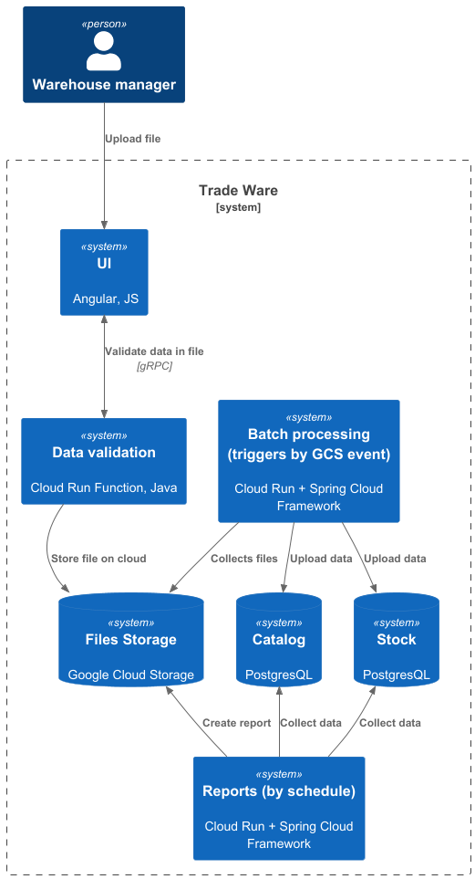

### **Название задачи:** Выбор инструментов для батч процессинга
### **Автор:** Марина Карманова
### **Дата:**
### **Функциональные требования**
 - Пользователь на основе Excel-шаблона формирует отчёт по остаткам и сохраняет его как CSV-файл. 
 - Первичная валидация формата данных происходит на уровне Excel-шаблона.
 - Пользователь запускает загрузку полученного CSV-файла через интерфейс ERP:
   1. Файл проходит дополнительную валидацию на уровне Java-приложения. В случае ошибки пользователь получает ответ в браузере: «Ошибка формата загружаемых данных».
   2. Файл сохраняется в хранилище в GCS.
   3. Запускается процесс обработки файла, обновление значениями из БД справочных данных и сохранения данных в БД номенклатуры.
   4. Если операция обработки завершается успешно, то пользователь получает уведомление об этом.
      Пользователь дожидается успешного завершения загрузки.
      При ошибке в формате данных пользователь вносит необходимые исправления в отчёт и повторяет загрузку.

| **№** | **Действующие лица или системы** | **Use Case**    | **Описание**                                                                                             |
|:-----:|:---------------------------------|:----------------|:---------------------------------------------------------------------------------------------------------|
|   1   | Пользователь, ERP                | Загрузка данных | Пользователь загружает CSV файл через ERP и ждет нотификации об ошибке либо об успешной обработке отчета |

### **Нефункциональные требования**

| **№** | **Требование**                                                                                                                       |
|:-----:|:-------------------------------------------------------------------------------------------------------------------------------------|
|   1   | Предполагаемая нагрузка — 100–150 параллельных загрузок в пиковые часы. Также нужна возможность гибко масштабироваться под нагрузкой |
|   2   | среднее время обработки отчёта на 2 000 строк составляет до 30 секунд                                                                |
|   3   | Внедрение системы централизованного сбора логов и метрик                                                                             |
|   4   | Формирование решения для дальнейшей миграции в микросервисную архитектуру                                                            |

### **Решение**
Т.к. в компании уже начался процесс по переходу в облако, было принято решение использовать рассмотреть инструменты, предлагаемые GCP.

Система может быть разделена на два компонента:  
 - загрузка файлов и их валидация - нужен отклик в пределах разумного времени для пользователя
 - загрузка данных в БД - SLA - 2000 строк за 30 секунд
 - обработка и формирование отчетов - можно перенести на ночное время и выполнять по расписанию

Было принято решение развернуть отдельный сервис для загрузки и валидации файлов.
Сервис скорее всего будет использоваться только в определенные часы и сразу же при пиковых нагрузках (например начало дня, когда все грузят данные за предыдущий день), то такой сервис должен быстро масштабироваться и не тратить ресурсы во время простоя.
В таком случае подойдет FaaS, а в частности Google Cloud Run Function.

Загрузка данных в БД, а так же формирование отчетов может быть более сложной и потребовать большего времени.
Для этих задач подойдет Google Cloud Run.

Оба этих инструмента отлично масштабируются и подходят для задач ETL

Для осуществления батч процессинга был выбран SpringBoot.

Плюсы решения:
1. У команды разработки есть компетенции
2. Spring Cloud GCP & Spring Cloud Functions - поддержка Google Cloud, существуют готовые решения для работы с Google Cloud Storage, Google Cloud Logging, Google Metrics, Google Cloud SQL
3. Есть система ретраев и нотификаций в случае ошибок обработки батча
4. Нативная интеграция с PostgresQL

Минусы решения:
1. Может быть оверкилом дла простого ETL 

### **Альтернативы**

**Google Dataflow** 

Плюсы решения:
1. Легкое масштабирование, сервис сам масштабируется в зависимости от нагрузок
2. Можно писать пайплайны на Java
3. Существует внутри инфраструктуры Google Cloud и совместим со всеми инструментами GCP по умолчанию

Минусы решения:
1. Предназначен больше для BigData, оверкил для текущих задач
2. Дороже чем Cloud Run

**Managed Apache Airflow**
Плюсы решения:
1. SaaS на базе Google Cloud - не нужно выделять ресурсы и сервера, полная поддержка инфраструктуры GCP
2. Автоматическое масштабирование

Минусы решения:
1. Нужны компетенции на Python

**Недостатки, ограничения, риски**
Spring периодически переносит свои продукты из Open-Source в Commercial Use, существует вероятность дополнительных затрат в будущем.

