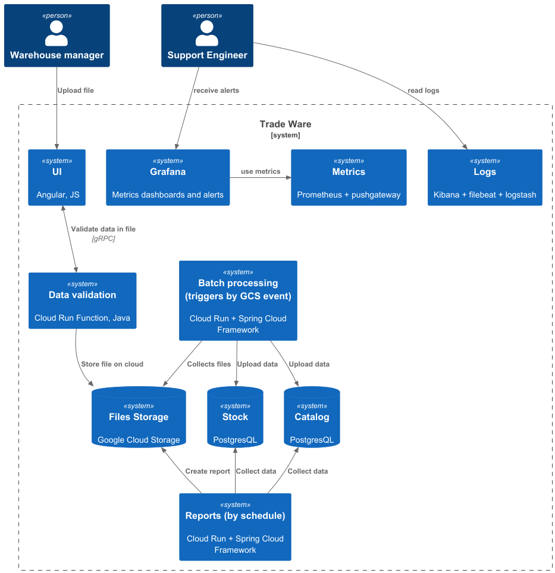

### **Название задачи:** Выбор инструментов для логгирования и мониторинга
### **Автор:** Марина Карманова
### **Дата:**
### **Функциональные требования**
 - Пользователь на основе Excel-шаблона формирует отчёт по остаткам и сохраняет его как CSV-файл. 
 - Первичная валидация формата данных происходит на уровне Excel-шаблона.
 - Пользователь запускает загрузку полученного CSV-файла через интерфейс ERP:
   1. Файл проходит дополнительную валидацию на уровне Java-приложения. В случае ошибки пользователь получает ответ в браузере: «Ошибка формата загружаемых данных».
   2. Файл сохраняется в хранилище в GCS.
   3. Запускается процесс обработки файла, обновление значениями из БД справочных данных и сохранения данных в БД номенклатуры.
   4. Если операция обработки завершается успешно, то пользователь получает уведомление об этом.
      Пользователь дожидается успешного завершения загрузки.
      При ошибке в формате данных пользователь вносит необходимые исправления в отчёт и повторяет загрузку.

| **№** | **Действующие лица или системы** | **Use Case**    | **Описание**                                                                                             |
|:-----:|:---------------------------------|:----------------|:---------------------------------------------------------------------------------------------------------|
|   1   | Пользователь, ERP                | Загрузка данных | Пользователь загружает CSV файл через ERP и ждет нотификации об ошибке либо об успешной обработке отчета |

### **Нефункциональные требования**

| **№** | **Требование**                                                                                                                       |
|:-----:|:-------------------------------------------------------------------------------------------------------------------------------------|
|   1   | Предполагаемая нагрузка — 100–150 параллельных загрузок в пиковые часы. Также нужна возможность гибко масштабироваться под нагрузкой |
|   2   | среднее время обработки отчёта на 2 000 строк составляет до 30 секунд                                                                |
|   3   | Внедрение системы централизованного сбора логов и метрик                                                                             |
|   4   | Формирование решения для дальнейшей миграции в микросервисную архитектуру                                                            |

### **Решение**

В индустрии давно существует стандарт 
OpenTelemetry + Kibana - для логирования 
Prometheus + Grafana - мониторинг метрик

Решили не изобретать велосипед и воспользоваться стандартными и проверенными решениями

Плюсы Kibana:
1. Есть компетенции, хорошо известный продукт
2. Возможность обрабатывать большое количество логов 

Плюсы Prometheus + Grafana:
1. Есть компетенции
2. Автоматическая сборка метрик
3. Есть возможность настроить алерты
4. Приятный графический интерфейс
5. Можно настраивать кастомные метрики + Spring Boot имеет достаточное количество собственных метрик

### **Альтернативы**

**Google Cloud Monitoring** 

Плюсы решения:
1. Нативное решение для GCP
2. Красивые дашборды

Минусы решения:
1. Нет компетенций у команды

**Недостатки, ограничения, риски**
Для батч процессинг джобов нужно дополнительно использовать pushgateway, т.к. Prometeus забирает метрики раз в 5-10 секунд и может не успеть забрать метрики для быстрого джоба

